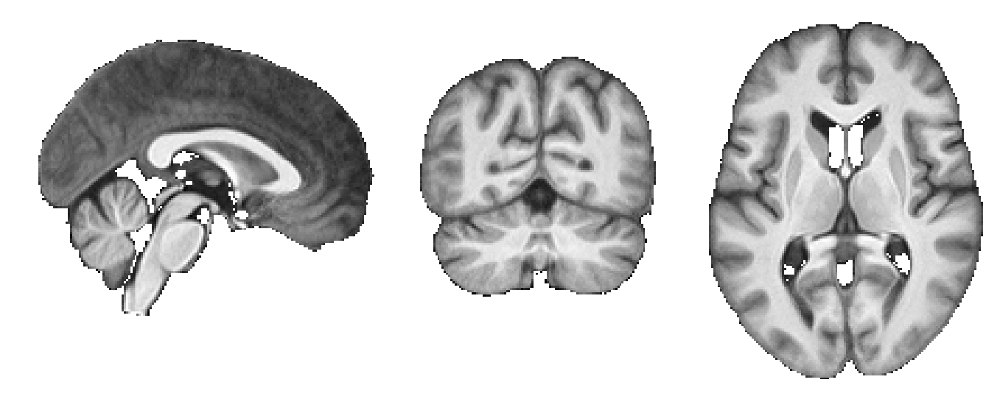

# DegenerationControlTemplate
Contains template image derived from patients with cerebellar degeneration and healthy controls and associated files.

## Dataset information
The template available in this repository were derived from structural MRI scans of 40 patients diagnosed with pure cerebellar cortical degeneration and 40 age and sex-matched neurologically healthy individuals.

Functional data is missing for (subject, timepoint):
- sub-57, post
- sub-70, pre
- sub-70, post

Structural data was acquired from all subjects.

## Template information

A study-specific template is included into this repository along with associated files:

| File                                  | Description                                                |
| ------------------------------------- | ---------------------------------------------------------- |
| DeCon_template.nii.gz                 | DeCon template image                                       |
| DeCon_template_mask.nii.gz            | DeCon template whole-brain mask                            |
| DeCon_template_cerebellar_mask.nii.gz | DeCon template cerebellar mask                             |
| DeCon_to_MNI_warp.nii.gz              | DeCon template non-linear warp to MNI152NLin6Asym template |
| MNI_to_DeCon_warp.nii.gz              | MNI152NLin6Asym template non-linear warp to DeCon template |

## Template validation

The template significantly reduces the spatial spread of anatomical landmarks in cerebellar patients and controls compared to existing templates. For the results and the code to reproduce the results, please see the [DegenerationConnectivity](https://github.com/carobellum/DegenerationConnectivity/tree/main) repository.
